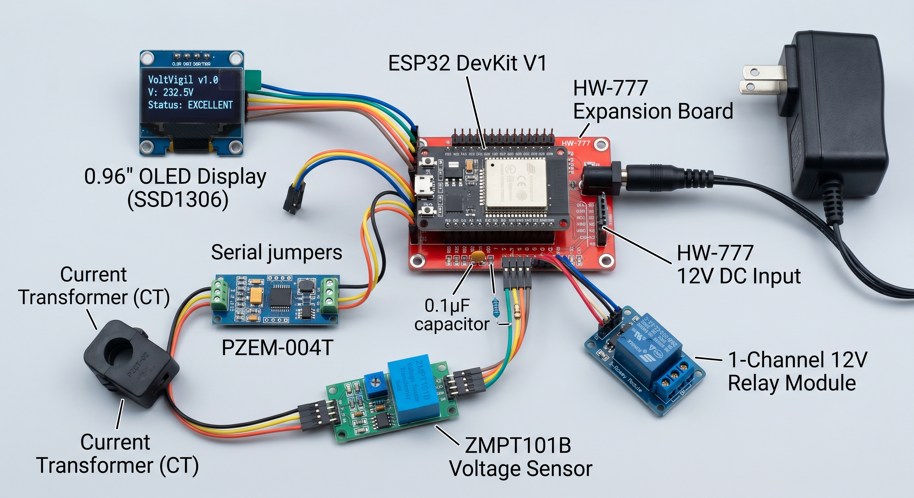

# VoltVigil

[](https://opensource.org/licenses/MIT)
[](https://www.espressif.com/en/products/socs/esp32)
[]()
[]()

---
VoltVigil is an industrial-grade, open-source telemetry and active safety relay system designed to monitor 230V AC mains electricity. Built on the ESP32 architecture, it provides real-time power quality analysis and physically isolates connected machinery when grid voltage fluctuates beyond safe operational thresholds.


## Table of Contents
1. [About the Project](#about-the-project)
2. [System Architecture](#system-architecture)
3. [Safety Disclaimer](#safety-disclaimer)
4. [Prerequisites](#prerequisites)
5. [Installation & Assembly](#installation--assembly)
6. [Usage](#usage)
7. [Repository Structure](#repository-structure)
8. [Contributing](#contributing)
9. [License](#license)
10. [Contact](#contact)

---

## About the Project

Small and medium-sized manufacturing facilities often suffer equipment degradation due to unstable power grids. Traditional power quality analyzers are prohibitively expensive for localized, machine-level monitoring. 

VoltVigil bridges this gap by offering:
* **Active Isolation:** Automatically disengages a 12V relay if RMS voltage drops below 215V or exceeds 240V.
* **Local Telemetry:** High-contrast 0.96-inch OLED display for immediate visual feedback on the factory floor.
* **Remote Monitoring:** Asynchronous embedded web server providing JSON data streams and a responsive HTML dashboard.
* **Waveform Analysis:** Analog AC sine wave capture via ZMPT101B for phase distortion monitoring.

---

## System Architecture

VoltVigil separates logic, sensing, and switching into isolated layers using the HW-777 Expansion Board.

* **Microcontroller:** ESP32 DevKit V1 (3.3V Logic)
* **Expansion & Routing:** HW-777 30P Expansion Board (Regulates 12V DC to 5V/3.3V)
* **Telemetry Layer:**
    * PZEM-004T v3.0 (RMS Voltage, Current, Power Factor)
    * PZCT-02 (100A Split-Core Current Transformer)
    * ZMPT101B (Voltage Transformer for Waveform)
* **Actuation Layer:** 1-Channel 12V Relay (10A/250VAC Rated)

---

## Hardware Setup Visual

The following diagram illustrates the complete low-voltage (DC) wiring strategy. It demonstrates how to safely distribute 12V, 5V, and 3.3V power to the various sensors and relays using the HW-777 expansion board while keeping the ESP32 logic pins isolated.


*Figure 1: Complete low-voltage component integration.*

---

## Safety Disclaimer

**DANGER: LETHAL VOLTAGE HAZARD**

This hardware interacts directly with live 230V AC mains electricity. 
* Assembly, testing, and deployment must be performed by or under the supervision of a qualified electrical professional.
* Never connect the ESP32 to a computer via USB while the AC mains are active.
* The use of an inline 1A glass fuse and a 7D471K MOV (Metal Oxide Varistor) is strictly mandatory for fire and surge protection.
* The authors and contributors of VoltVigil assume no liability for property damage, injury, or death resulting from the use of this repository.

---

## Prerequisites

### Software Dependencies
Ensure the following libraries are installed in your Arduino IDE (v2.0+ recommended):
* `PZEM004Tv30` by Jakub Mandula
* `Adafruit GFX Library`
* `Adafruit SSD1306`
* `ESPAsyncWebServer` (Must be installed manually via GitHub ZIP)
* `AsyncTCP` (Must be installed manually via GitHub ZIP)

### Hardware Requirements
Refer to the `docs/bill_of_materials.md` for a comprehensive list of required components, safety hardware, and cabling specifications.

---

## Installation & Assembly

### 1. Firmware Configuration
1. Clone the repository:
   ```bash
   git clone [https://github.com/EobardThawne2/voltvigil.git](https://github.com/EobardThawne2/voltvigil.git)
   ```
2. Navigate to `firmware/voltvigil_master/config.h`.
3. Update the `SSID` and `PASSWORD` variables with your local network credentials.
4. Adjust `MAX_VOLTS` and `MIN_VOLTS` if your regional safety standards differ from the 215V-240V default.
5. Flash `voltvigil_master.ino` to the ESP32. Disconnect USB upon completion.

### 2. Low-Voltage Assembly (DC)
1. Mount the ESP32 to the HW-777 Expansion Board.
2. Verify the expansion board's power jumper is set to **3.3V**.
3. Route the sensors and relay according to the pinout defined in `hardware/wiring_maps/expansion_board_svg.md`.

### 3. Calibration
1. Flash `firmware/calibration_tools/zmpt_wave_plotter.ino` to the ESP32.
2. Open the Arduino IDE Serial Plotter (115200 Baud).
3. Adjust the ZMPT101B potentiometer until the waveform fits within the 0-4095 ADC limits without clipping.

### 4. High-Voltage Integration (AC)
Route the AC mains through the protective fuse and relay layout as strictly defined in `hardware/wiring_maps/mains_ac_routing.md`.

---

## Usage

1.  **Power On:** Connect the 12V DC power adapter to the expansion board. The OLED will initialize and attempt WiFi connection.
2.  **Mains Engagement:** Apply 230V AC to the fused input.
3.  **Operation:** If grid voltage is stable, the relay will engage, powering the load, and the OLED will display `STATUS: EXCELLENT`.
4.  **Remote Access:** Navigate to the IP address displayed on the OLED via any web browser connected to the same network to view the live dashboard.

---

## Repository Structure

```text
voltvigil/
├── firmware/
│   ├── voltvigil_master/       # Core application (logic, config, HTML)
│   └── calibration_tools/      # ZMPT101B wave plotting utility
├── hardware/
│   ├── wiring_maps/            # Markdown guides for AC and DC routing
│   └── bill_of_materials.md    # Master component list
├── docs/                       
│   ├── safety_protocols.md     # Mandatory AC handling procedures
│   └── troubleshooting.md      # Solutions for sensor data and compile errors
├── LICENSE
└── README.md
```

## Contributing

Contributions make the open-source community an incredible place to learn, inspire, and create. Any contributions you make are greatly appreciated.

1. Fork the Project
2. Create your Feature Branch (`git checkout -b feature/AmazingFeature`)
3. Commit your Changes (`git commit -m 'Add some AmazingFeature'`)
4. Push to the Branch (`git push origin feature/AmazingFeature`)
5. Open a Pull Request

*Note: All hardware modifications proposed in pull requests must include updated safety documentation.*

---

## License

Distributed under the MIT License. See `LICENSE` for more information.

---

## Contact

Sumeer Khattar

[](mailto:sumeerkhattar@gmail.com)
[](https://www.linkedin.com/in/sumeer-khattar)
[](https://sumeer-khattar-portfolio.vercel.app/)

Project Link: [https://github.com/EobardThawne2/voltvigil](https://github.com/EobardThawne2/voltvigil)